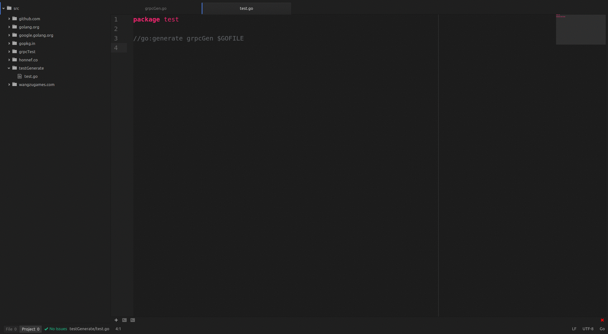
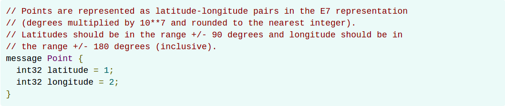
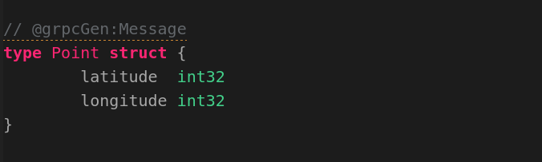
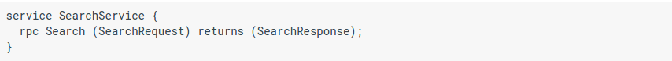
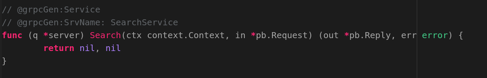

# grpcGen

A tool for auto converting go code into [gRPC](http://www.grpc.io/) [Protobuf](https://developers.google.com/protocol-buffers/) file.

## Howto
simply type these in a go file:
```go
package YourPackageName
//go:generate grpcGen $GOFILE
```
and then in terminal:
```shell
$ go generate
```
it will generated an example go code for you to modify.
once you done the modification, then just type the same command as previous one in the terminal, it will generating an protobuf file and calling gRPC tool to generate an gRPC go code for you. **THAT'S IT**


## More Detail
There are three important symbol that will be referenced by grpcGen:
1. @grpcGen:Message
2. @grpcGen:Service
3. @grpcGen:SrvName:
### @grpcGen:Message
It is the [Protobuf Message type](https://developers.google.com/protocol-buffers/docs/proto3#simple), gRPC using this Message type for data communication. In here, you only need to define a go structure but with the message symbol ***@grpcGen:Message*** then grpcGen will parsing them into gRPC Message type for you and mark the go structure you defined as commends for letting others to understand our IN, OUT structure looks like! 
### @grpcGen:Service and @grpcGen:SrvName:
It is the [Protobuf Service type](https://developers.google.com/protocol-buffers/docs/proto3#services), gRPC using this Service type for defining open interface for letting other programs to call. In here, you have to define a go function with ***@grpcGen:Service*** and ***@grpcGen:SrvName:*** symbols. @grpcGen:SrvName: means the gRPC service name, of course you can defining two functions with the same SrvName, the grpcGen will auto parsing them into same service you named it!
